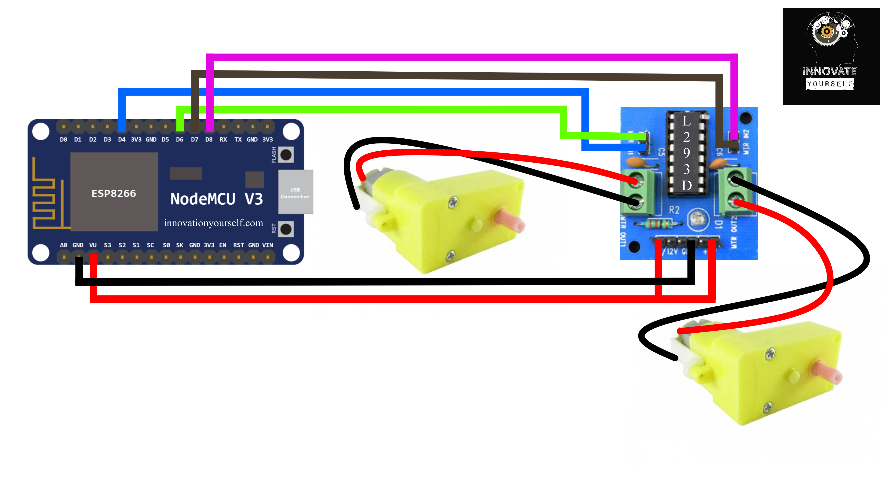

# Controlling a Robotic Car with MQTT using NodeMCU

This repository contains the code and instructions for controlling a robotic car using MQTT protocol with NodeMCU.

## Table of Contents
- [Overview](#overview)
- [Hardware Requirements](#hardware-requirements)
- [Software Requirements](#software-requirements)
- [Circuit Diagram](#circuit-diagram)
- [Installation](#installation)
- [Usage](#usage)
- [Contributing](#contributing)
- [License](#license)

## Overview
In this project, we demonstrate how to control a robotic car remotely using MQTT messaging protocol. We use NodeMCU, an ESP8266-based microcontroller, to connect the car to an MQTT broker. The car can be controlled using a mobile app or any MQTT client that can publish messages to the specified topics.

## Hardware Requirements
- NodeMCU ESP8266
- Motor driver module (L293D)
- Robot car chassis
- DC motors
- Wheels
- Jumper wires
- Power source (battery pack or USB power bank)

## Software Requirements
- Arduino IDE
- PubSubClient library
- ESP8266WiFi library

## Circuit Diagram

Connect the components as per the circuit diagram provided above. Make sure to power the NodeMCU and the motor driver separately.

## Installation
1. Clone this repository to your local machine.
2. Open the `MQTT_Robot_Control.ino` file in the Arduino IDE.
3. Install the required libraries (`PubSubClient` and `ESP8266WiFi`) in the Arduino IDE.
4. Set the appropriate Wi-Fi credentials and MQTT broker details in the code.
5. Connect the NodeMCU to your computer via USB and upload the code to the microcontroller.

## Usage
1. Power up the robotic car.
2. Ensure that the NodeMCU is connected to the MQTT broker and subscribed to the appropriate topics.
3. Use an MQTT client or the provided mobile app to publish messages to the control topics and control the car remotely.
4. Enjoy controlling your robotic car!

## Contributing
Contributions are welcome! Fork this repository and make your desired changes. Submit a pull request, and we'll review your contributions.

## License
This project is licensed under the [MIT License](LICENSE). Feel free to use and modify the code according to your needs.
